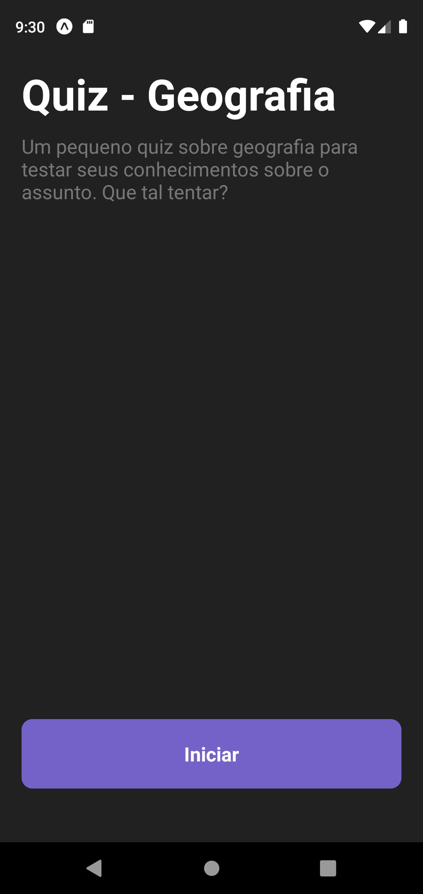
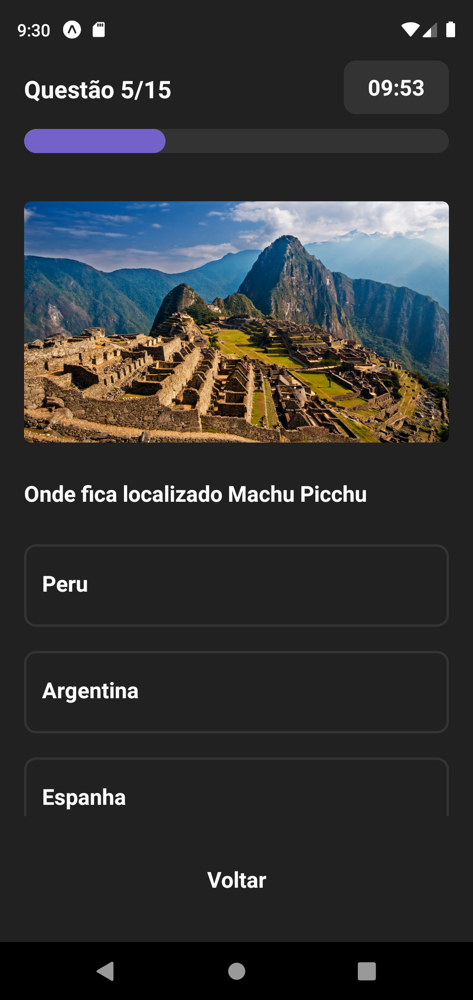
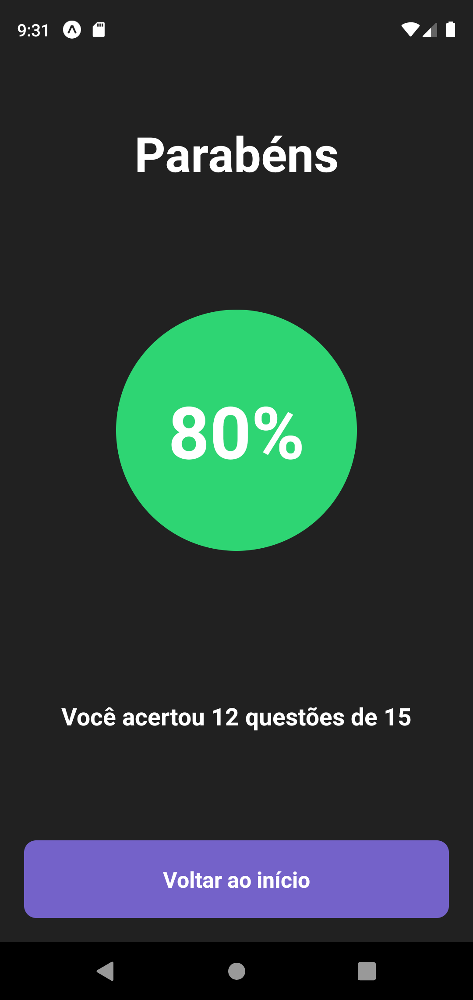

# Teste React Native Octupus

<p align="center">
  
  
  
</p>

<p align="center">
  
  
  
</p>

## 📋 Tecnologias

Esse projeto foi desenvolvido com as seguintes tecnologias:

- [React Native](https://reactnative.dev/)
- [Expo](https://expo.io/)
- [React Navigation](https://reactnavigation.org/)
- [Styled Components](https://styled-components.com/)
- [Redux](https://redux.js.org/)
- [React Redux](https://react-redux.js.org/)
- [TypeScript](https://www.typescriptlang.org/)

## 👨‍💻 Como usar

- Necessário [Node.js](https://nodejs.org/en/) e o [Expo Cli](https://docs.expo.io/)

- Clonar este respositório:
  ```
  $ git clone https://github.com/Skuth/teste-react-native-octupus
  ```
- Instale as dependências:
  ```
  $ yarn
  ```
- Inicie o Expo com:
  ```
  $ yarn start
  ```

## 🎢 Objetivo

- Criar um aplicativo de quiz em React Native.

## 📕 Regras

- Página home com um texto explicativo e um botão para iniciar o quiz.
- O quiz deverá ter 15 questões
  - Insira uma imagem para cada questão
  - Cada questão terá 5 alternativas
- Página de resultado
- As perguntas ficaram por conta do desenvolvedor. Escolha os assuntos que achar mais interessante: geografia, esportes, conhecimentos gerais etc.

## ✨ Desafios adicionais (não obrigatório, mas será um diferencial)

- Adicione um cronômetro de 10 minutos. Se o usuário não terminar dentro desse tempo finalizar o quiz e ir para os resultados.
- Utilizar styled-components para escrever a estilização
- Gerenciar o estado da aplicação com Redux
- Configurar prettier e eslint no projeto.

## 📝 Licença

Esse projeto está sob a licença MIT. Veja o arquivo [LICENSE](LICENSE.md) para mais detalhes.